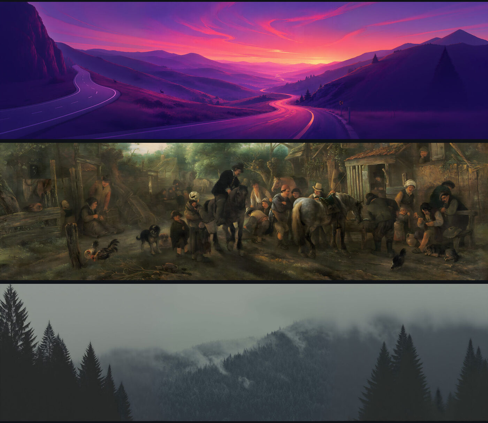
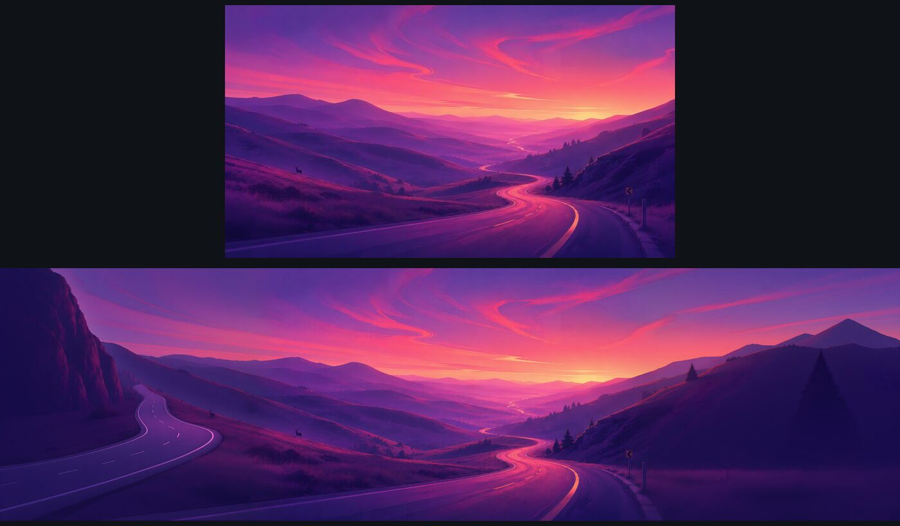

# Ultrawide Background for Omarchy

Omarchy's themes ship beautiful backgrounds — at 16:9 and 3:2. On a 32:9 or 21:9
display they get centre-cropped, and you lose most of the picture.

This is the missing half: every stock Omarchy background, rebuilt for ultrawide,
plus a background plugin that gives **each monitor the version that fits it**.



## The difference

The stock image on a 32:9 screen, then the same background from this pack:



## Install

```bash
git clone https://github.com/johnsideserf/omarchy-ultrawide-background
cd omarchy-ultrawide-background
./install.sh                 # detects your monitor, fetches the right pack, adds menu rows
```

That's it. `install.sh` picks the pack matching your display, installs the images,
adds a **Style → Ultrawide backgrounds** section to the Omarchy menu, and links the
`omarchy-ultrawide` command into `~/.local/bin`.

To also swap in the monitor-aware renderer (needed only for **mixed** monitor
setups — see below):

```bash
omarchy plugin add https://github.com/johnsideserf/omarchy-ultrawide-background
omarchy-ultrawide enable      # enables this renderer, disables the stock one
```

### Packs

| Pack | Resolution | For |
|---|---|---|
| `32x9` | 5120×1440 | Samsung G9 and other 32:9 super-ultrawides |
| `5k2k` | 5120×2160 | 5K2K ultrawides (LG 40WP95C and similar) |
| `21x9-1600` | 3840×1600 | 38" 21:9 ultrawides |
| `21x9` | 3440×1440 | The common 34" 21:9 ultrawide |
| `21x9-1080p` | 2560×1080 | 21:9 at 1080p |

Every pack contains all 92 stock Omarchy backgrounds. Where the source
resolution allows, each pack is cut from the **original** artwork rather than
rescaled from another pack, so nothing is upscaled unnecessarily — the taller
formats (5K2K, 3840×1600) in particular go back to the source, which still has
the vertical detail a 32:9 crop discards.

The 21:9 packs are cropped from the 32:9 masters, so they are pixel-exact, never
upscaled.

## How the images were made

There is no single trick that works on 92 wildly different images, so each one is
routed to whichever method suits it — and every method keeps the original artwork
untouched:

| Method | What it does | Used when |
|---|---|---|
| **Crop** | A 32:9 band cut straight out of the full-resolution source | The source has the pixels to spare. Nothing is invented; often a *downscale*, so it is sharper than the original at 1:1. **Always preferred.** |
| **Outpaint** | Flux.1 Fill (local) or Flux Pro (API) paints new flanks, then a native-resolution refinement pass | The composition would be destroyed by cropping |
| **Pixel-mirror** | The image's own edge pixels, mirrored, then repainted enough to break the symmetry | Fine repetitive texture — forest canopy, water — where generated flanks go soft |
| **Matte** | Flanks extended as a colour field, an edge gradient, or a fade to black | Logos, posters and single-subject art, where any generative model invents text or duplicate subjects |

Whatever the method, **the original image is composited back over the centre
verbatim** — the middle of every wallpaper is the artwork, pixel for pixel.

Each image was reviewed by eye at 100% on both seams, and anything with a visible
join, a duplicated subject or invented lettering was reworked or re-routed.

## Monitor-aware rendering

The stock background plugin binds every screen to one file, so a 32:9 and a 16:9
output cannot both be served correctly. This plugin resolves the background
**per screen**:

```
$ omarchy-ultrawide status
  OUTPUT     RESOLUTION    PACK         SHOWS
 *DP-3       5120x1440     32x9         2-geometric.jpg   [32x9]
  HDMI-A-1   1920x1080     -            stock image (no pack for this shape)
```

Screens with no matching pack fall back to the stock image, so a laptop next to an
ultrawide keeps working exactly as before.

If you only have ultrawide monitors you don't need the plugin at all — the images
alone are enough.

## Commands

```bash
omarchy-ultrawide install [RATIO]   # install a pack (auto-detects by default)
omarchy-ultrawide switch RATIO      # change pack
omarchy-ultrawide status            # per-monitor: what each screen shows
omarchy-ultrawide packs             # list installed packs
omarchy-ultrawide uninstall         # remove every file it installed
omarchy-ultrawide enable|disable    # swap the renderer in / restore the stock one
```

## Requirements and dependencies

- **Omarchy 3+** with the Quickshell-based shell (`omarchy-shell`)
- `curl` — downloading the packs from the GitHub release
- `python3` — monitor detection and JSON handling in the CLI (stock on Omarchy)
- `imagemagick` (`magick`) — only for `scripts/make-variants.sh`, if you derive
  packs yourself; not needed for a normal install
- `hyprctl` — monitor detection. Without it the CLI defaults to the 32:9 pack
- `zstd`/`tar` — unpacking the release archives (stock on Arch)

No network access is used after the initial pack download. No daemon, no
telemetry, nothing runs in the background: the plugin is a QML service inside the
existing shell process, and the CLI only runs when you invoke it.

Disk: 122 MB (32:9), 89 MB (21:9), 56 MB (21:9-1080p) per installed pack.

## What it touches

Nothing in `/usr/share/omarchy` — verify with `pacman -Qkk omarchy`.

Images are installed to Omarchy's documented user paths:

- default: `~/.config/omarchy/backgrounds/<theme>/` — they **join** the theme's
  background cycle alongside the stock ones
- `--replace`: `~/.config/omarchy/themes/<theme>/backgrounds/` — they **replace**
  the stock backgrounds when a theme is applied

Backgrounds stay tied to themes exactly as Omarchy intends: `Super+Ctrl+Space`
cycles them, `omarchy theme set` applies them. Every installed file is recorded in
a manifest, and `omarchy-ultrawide uninstall` removes precisely those files.

The optional bar widget in `optional/` is **not** installed by default — the menu
rows cover the same ground without taking permanent space on your bar.

## Credits and licensing

The backgrounds are Omarchy's, and the credit for them belongs to their original
artists. This project only reformats them for ultrawide displays; every image here
is a derivative of a file shipped in
[basecamp/omarchy](https://github.com/basecamp/omarchy) (MIT).

Many were produced by cropping alone. Where a wider frame required it, the
extensions were generated with Flux.1 Fill and Flux Pro — **the invented parts are
always the outer flanks; the original artwork is never regenerated.**

If you are an artist whose work is here and you would rather it were not, open an
issue or email me and it will be removed the same day.

The code — plugin, CLI and scripts — is MIT. See [`ATTRIBUTION.md`](ATTRIBUTION.md)
for the per-theme detail.

## Building the packs yourself

The pipeline is not in this repo (it needs ComfyUI, ~18 GB of models and a GPU),
but `scripts/make-variants.sh` derives the narrower packs from the 32:9 masters,
which is all most people need:

```bash
./scripts/make-variants.sh ~/.config/omarchy/themes ./backgrounds
```
